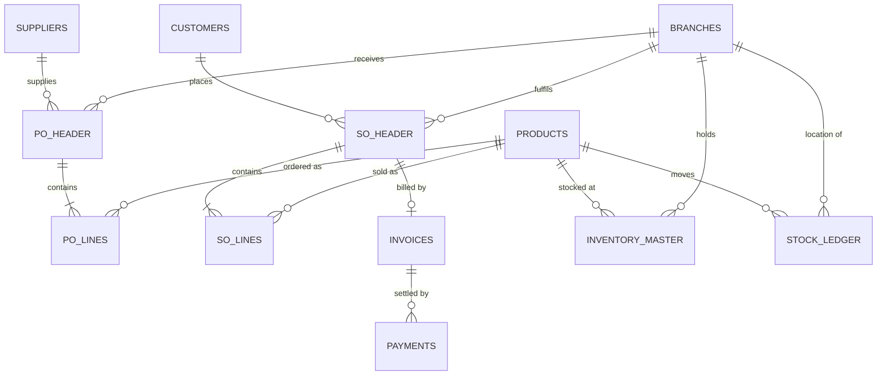

<!-- ═══════════════ CAREER CONTROL TOWER · REPOSITORY · HWI ═══════════════ -->
<div align="center">


<a href="https://github.com/Eswar5313"></a> <a href="https://eswar5313.github.io/Eswar-Master-Project-Portfolio-2026/"></a> <a href="https://eswar5313.github.io/Eswar-Portfolio-Lens-Index-2026/"></a> <a href="heavy-warehouse-intelligence/"></a> <a href="HWI_Project_Control_Book.xlsx"></a>

     

**CadetX Virtual Work Experience · Data Analytics & Data Science · team of 3 · Eswar as Data Scientist** — inventory health · supplier reliability · demand forecasting · warehouse efficiency

</div>


## 🏗️ Heavy Warehouse Intelligence (HWI)

**CadetX Virtual Work Experience · Data Analytics & Data Science · 12-week agile programme**

> 📁 Project code, data and docs live in [`heavy-warehouse-intelligence/`](heavy-warehouse-intelligence/) · Excel control book: [`HWI_Project_Control_Book.xlsx`](HWI_Project_Control_Book.xlsx)

> A unified analytics and forecasting framework built on a heavy-equipment spare-parts supply chain — 6 Indian warehouses, 30 heavy-machinery SKUs (CAT, JCB, Komatsu, Volvo, Tata Hitachi), 8 Chinese suppliers, 500 B2B customers and 6 years (2019–2024) of purchase, sales, invoice, payment and stock-movement history.


## 1. Project Introduction

Warehouses handling heavy goods face stock imbalance, overstocking, stockouts, poor space utilisation, unreliable suppliers and inaccurate demand forecasting. Raw operational data exists in the ERP, but without structured analysis it never becomes a decision.

**Goal:** build a data-driven *warehouse intelligence capability* that lets an operations team

| # | Capability | Business outcome |
|---|-----------|------------------|
| 1 | Understand product movement & demand patterns | Right stock, right branch, right time |
| 2 | Measure inventory health & utilisation | Release capital locked in dead stock |
| 3 | Evaluate warehouse operational efficiency | Higher throughput per sq ft and per employee |
| 4 | Reduce stock risks & operational waste | Fewer stockouts, less shrinkage, fewer write-offs |
| 5 | Support procurement & planning decisions | Reliable suppliers, optimal reorder points, safety stock |


## 2. Team

| Role | Name | GitHub | Responsibilities |
|------|------|--------|------------------|
| Data Scientist | **Eswar Mahalingam** | `@<handle>` | Demand forecasting, stockout-risk model, reorder-point & safety-stock optimisation, anomaly detection |
| Data Analyst 1 | `<Teammate name>` | `@<handle>` | Data profiling & cleaning, product / inventory / warehouse KPIs, Power BI dashboards |
| Data Analyst 2 | `<Teammate name>` | `@<handle>` | Supplier & customer analytics (reliability, RFM, CLV, churn), KPI framework, insight reports |

**Scrum Master** rotates weekly — see `excel/HWI_Project_Control_Book.xlsx › 04_Sprint_Tracker` and each `sprints/week-XX/SPRINT_NOTES.md`.


## 3. Repository Structure

```
heavy-warehouse-intelligence/
├── README.md                      ← you are here
├── LICENSE
├── requirements.txt               ← pinned Python dependencies
├── .gitignore
├── .github/
│   ├── workflows/ci.yml           ← lint + notebook smoke-test on every push
│   ├── ISSUE_TEMPLATE/task.md     ← sprint task template
│   └── PULL_REQUEST_TEMPLATE.md
├── data/
│   ├── raw/                       ← 12 original CSVs (never edited)
│   ├── processed/                 ← cleaned parquet/CSV outputs of src/hwi/clean.py
│   └── dictionary/                ← data_dictionary.md + ERD
├── docs/
│   ├── 01_project_charter.md
│   ├── 02_kpi_framework.md
│   ├── 03_data_quality_report.md
│   ├── 04_methodology.md          ← forecasting, RFM, ABC, EOQ formulas
│   ├── 05_roadmap.md              ← 12-week phased plan
│   └── CONTRIBUTING.md            ← branching, commits, PR rules
├── excel/
│   └── HWI_Project_Control_Book.xlsx   ← data dictionary, KPI register, sprint tracker,
│                                         task catalogue, DQ log, team roster (styled)
├── notebooks/
│   ├── 00_template.ipynb
│   ├── 01_data_profiling.ipynb
│   ├── 02_data_cleaning.ipynb
│   └── ...                        ← one notebook per catalogue task, numbered
├── src/hwi/                       ← reusable Python package
│   ├── __init__.py
│   ├── config.py                  ← paths, constants, colour palette
│   ├── load.py                    ← typed loaders for all 12 tables
│   ├── clean.py                   ← cleaning & validation rules
│   ├── features.py                ← feature engineering (lead-time, velocity, ageing…)
│   └── kpis.py                    ← KPI calculators reused by notebooks & dashboards
├── dashboards/
│   ├── powerbi/                   ← .pbix files
│   ├── tableau/                   ← .twbx files
│   └── exports/                   ← PNG/PDF snapshots for README & reviews
├── models/                        ← saved forecasting / classification models (.pkl, .json)
├── reports/                       ← weekly insight decks & final presentation
└── sprints/
    ├── week-01/ … week-12/
    │   ├── SPRINT_NOTES.md        ← Scrum Master's notes (goal, tasks, owners, blockers, retro)
    │   ├── analysis/              ← that week's notebooks / scripts
    │   └── outputs/               ← charts, tables, model artefacts
    └── SPRINT_NOTES_TEMPLATE.md
```


## 4. Dataset

Source: CadetX *Heavy Suppliers / Warehouse / Inventory / Customer* transactional dataset (12 CSVs + Fields Documentation).

| Table | Rows | Grain | Key | Joins to |
|-------|-----:|-------|-----|----------|
| `branches.csv` | 6 | One warehouse/branch | `branch_id` | inventory, SO, PO, invoices, customers |
| `products.csv` | 30 | One SKU (heavy-machinery spare part) | `product_id` | inventory, SO lines, PO lines, stock ledger |
| `suppliers.csv` | 8 | One supplier (all China-based) | `supplier_id` | purchase_orders_header |
| `customers.csv` | 500 | One B2B customer | `customer_id` | SO header, invoices |
| `inventory_master.csv` | 180 | Product × Branch (30 × 6) | `product_id`+`branch_id` | products, branches |
| `purchase_orders_header.csv` | 24,000 | One PO | `po_id` | suppliers, branches, PO lines |
| `purchase_orders_lines.csv` | 155,495 | One PO line | `po_id`+`line_number` | PO header, products |
| `sales_orders_header.csv` | 20,000 | One SO | `so_id` | customers, branches, SO lines, invoices |
| `sales_orders_lines.csv` | 130,402 | One SO line | `so_id`+`line_number` | SO header, products |
| `invoices.csv` | 18,033 | One invoice (1 per delivered SO) | `invoice_id` | SO header, customers, payments |
| `payments.csv` | 19,257 | One payment against an invoice | `payment_id` | invoices |
| `stock_ledger.csv` | 237,230 | One stock movement (IN / OUT / ADJUSTMENT) | `movement_id` | products, branches, PO/SO |

**Coverage:** orders 01-Jan-2019 → 31-Dec-2024 · payments to Mar-2025 · stock ledger to Jan-2025. Full column-level dictionary: [`data/dictionary/data_dictionary.md`](heavy-warehouse-intelligence/data/dictionary/data_dictionary.md).

### Entity-relationship map



### Known data-quality flags (from Week-1 profiling)

* `purchase_orders_header.received_date` is null for the 2,370 *Cancelled* POs (expected, not an error).
* `inventory_master.current_stock` (≈100k units) is 200–1,000× `max_stock` — treat as a **shrinkage/ledger-reconciliation test case**, reconcile against `stock_ledger.running_balance`.
* `branches.warehouse_capacity` is a text field (`"45230 sqft"`) → parse to integer.
* Supplier `pincode` values are 6-digit Indian format on Chinese addresses → treat as synthetic, don't geocode.
* All suppliers are China-based → 100 % import dependency; `import_duty_rate` becomes a landed-cost driver.


## 5. KPI Framework (headline)

| Domain | KPI | Definition |
|--------|-----|------------|
| Inventory | Inventory Turnover | COGS ÷ Average inventory value |
| Inventory | Days of Inventory (DIO) | 365 ÷ Turnover |
| Inventory | Stockout Rate | Product-branch-days with balance ≤ 0 ÷ total days |
| Inventory | Overstock % | SKUs where balance > `max_stock` |
| Warehouse | Throughput / day | IN + OUT ledger units ÷ operating days |
| Warehouse | Revenue per sq ft | `avg_monthly_revenue` ÷ capacity |
| Warehouse | Operating margin | (Revenue − op cost) ÷ Revenue |
| Supplier | On-Time Delivery % | POs with `received_date ≤ expected_delivery_date` |
| Supplier | Lead-time variance | σ(actual − promised lead time) |
| Supplier | Cancellation rate | Cancelled POs ÷ total POs |
| Customer | RFM score / CLV | Recency, Frequency, Monetary on invoices |
| Customer | DSO | Avg. days invoice → payment |
| Finance | Collection rate | Paid ÷ Invoiced |

Full register with formulas, source tables, owners and targets: [`docs/02_kpi_framework.md`](heavy-warehouse-intelligence/docs/02_kpi_framework.md) and the `03_KPI_Framework` sheet of the control book.


## 6. 12-Week Roadmap

| Phase | Weeks | Focus | Key deliverables |
|-------|-------|-------|------------------|
| 1 · Foundation | 1–3 | Profiling, cleaning, integration, feature engineering, data dictionary | `src/hwi/clean.py`, DQ report, star-schema `data/processed/`, first KPIs |
| 2 · Product / Inventory / Warehouse | 4–6 | Fast/slow movers, ABC-XYZ, turnover, ageing, over/understock, space & throughput | Product & warehouse scorecards, Inventory Health dashboard v1 |
| 3 · Supplier / Customer / Predictive | 7–9 | Supplier reliability & risk, RFM, CLV, churn, demand forecasting, stockout & reorder prediction | Supplier scorecard, customer segments, forecasting model (Prophet/XGBoost), reorder-point engine |
| 4 · BI & Strategy | 10–12 | Dashboards, KPI framework, anomaly detection, strategy recommendations, final presentation | 5 dashboards, anomaly monitor, strategy deck, final README portfolio |

Detailed week-by-week plan: [`docs/05_roadmap.md`](heavy-warehouse-intelligence/docs/05_roadmap.md).


## 7. Weekly Delivery Log

| Week | Sprint goal | Scrum Master | Status | Link |
|-----:|-------------|--------------|--------|------|
| 01 | Profile all 12 tables, agree KPIs, set up repo & control book | Eswar | 🟡 In progress | [`sprints/week-01`](heavy-warehouse-intelligence/sprints/week-01/SPRINT_NOTES.md) |
| 02 | Cleaning rules + star schema + data dictionary v1 | Analyst 1 | ⚪ Planned | [`sprints/week-02`](heavy-warehouse-intelligence/sprints/week-02/SPRINT_NOTES.md) |
| 03 | Feature engineering + validation suite + first KPI pack | Analyst 2 | ⚪ Planned | [`sprints/week-03`](heavy-warehouse-intelligence/sprints/week-03/SPRINT_NOTES.md) |
| 04–12 | see `docs/05_roadmap.md` | rotating | ⚪ Planned | |


## 8. Getting Started

```bash
git clone https://github.com/<org>/heavy-warehouse-intelligence.git
cd heavy-warehouse-intelligence
python -m venv .venv && source .venv/bin/activate     # Windows: .venv\Scripts\activate
pip install -r requirements.txt
python -m hwi.load --check        # verifies all 12 CSVs load & keys join
jupyter lab                       # open notebooks/01_data_profiling.ipynb
```

```python
from hwi.load import load_all
db = load_all()                   # dict of 12 pandas DataFrames, typed & date-parsed
db["stock_ledger"].head()
```


## 9. Working Agreements

* **Branching:** `main` (protected) ← `week-XX/<task-slug>` feature branches via PR; one approval required.
* **Commits:** `week-03: add supplier OTD calculation (#12)` — week prefix + imperative verb + issue number so individual contribution is visible.
* **Notebooks:** numbered `NN_task_name.ipynb`; every notebook ends with a *Results Summary* markdown cell; outputs cleared before commit (`nbstripout`).
* **Definition of Done:** code runs top-to-bottom, results summary written, chart exported to `outputs/`, row added to `04_Sprint_Tracker`, reviewed by one teammate.
* **Meetings:** Mon planning (30 min) · Wed stand-up (15 min) · Fri review + retro (30 min); notes in `SPRINT_NOTES.md`.
* **Submission:** every Friday the Scrum Master tags `vWeek-XX`, pushes, and pastes the repo link into the CadetX portal.


## 10. Tech Stack

`Python 3.10` · `pandas` · `numpy` · `scikit-learn` · `statsmodels` · `prophet` · `xgboost` · `plotly` · `matplotlib` · `seaborn` · `openpyxl` · `duckdb` (SQL over CSV) · `Power BI` · `Jupyter` · `GitHub Actions`


## 11. Licence & Acknowledgements

Dataset © CadetX, supplied for educational use within the Virtual Work Experience programme. Code released under the MIT Licence. Built by the HWI team as part of the *Heavy Supplier, Inventory & Warehouse Analytics* project.


<div align="center">

**Eswar Mahalingam** · B.Com · MBA · PGDLSCM · CSCMP SCPro · Six Sigma Black Belt
Data Scientist @ Zidio Development · Ghaziabad NCR, India · Open to India · EU (Blue Card) · Gulf · Immediate joiner

[](https://linkedin.com/in/eswar-mahalingam)
[](mailto:eswarmba05313@gmail.com)
[](tel:+919360548243)
[](https://eswar-3d-portfolio.netlify.app)
[](https://github.com/Eswar5313)


</div>
